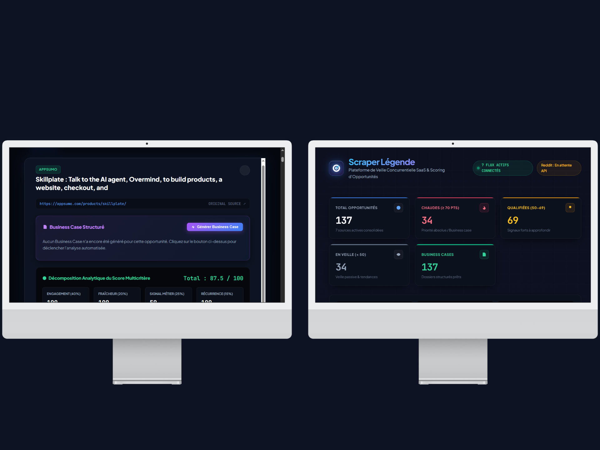
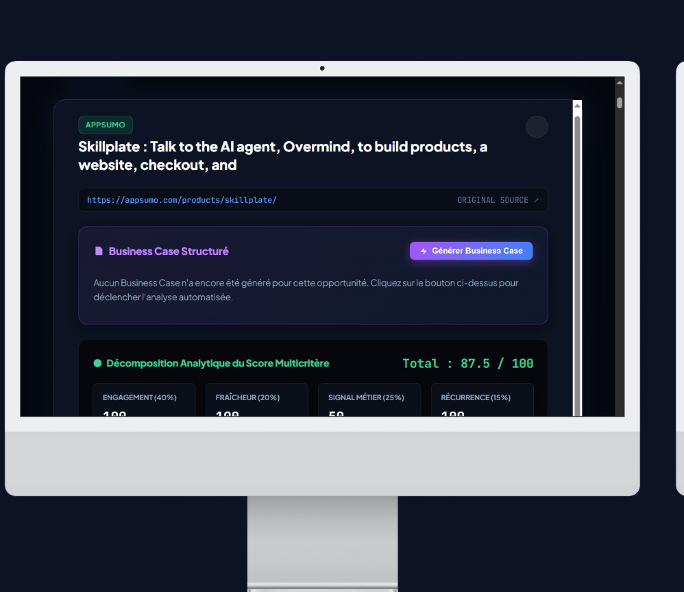
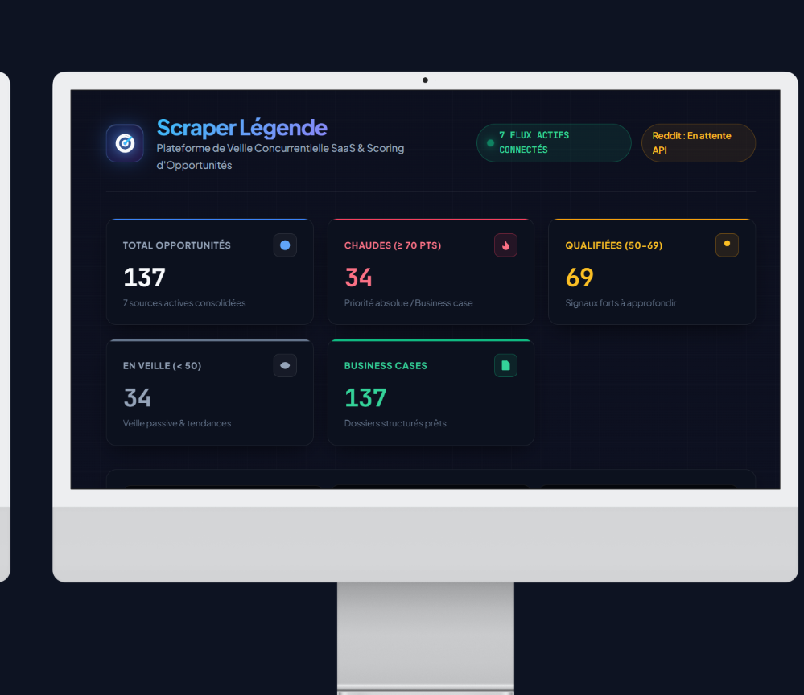

# 📊 Rapport d'Étude de Cas — Scraper Légende (V2)
**Moteur de Veille Concurrentielle, Scoring Prédictif & Génération Automatisée de Business Cases**

---

## 🎯 1. Contexte & Vision du Projet

Dans le cadre du développement de mes projets SaaS et de mon portfolio en Ingénierie IA / Développement Web, **Scraper Légende** a été conçu pour résoudre un défi critique pour les solopreneurs, agences et équipes produit : **comment détecter rapidement des opportunités de marché viables sans perdre des dizaines d'heures à scanner manuellement des dizaines de plateformes ?**

Le projet a été entièrement reconstruit selon une démarche rigoureuse par phases incrémentales, garantissant un système démontrable et résilient à chaque étape.


*Figure 1 : Vue d'ensemble du tableau de bord avec répartition des opportunités par tranche de score et modal d'inspection détaillée.*

---

## 🔍 2. Problématique & Objectifs Techniques

| Défi Initial | Solution Implémentée dans Scraper Légende V2 |
|---|---|
| **Dispersion des sources** | Connexion automatisée à **7 flux complémentaires** (showcase produits, besoins exprimés, traction commerciale). |
| **Bruit & redondance** | Système de **déduplication idempotente** stricte sur `(source, url)`. |
| **Difficulté de priorisation** | **Algorithme de scoring multicritère (0-100)** transparent et vérifiable (pas de boîte noire). |
| **Charge d'analyse manuelle** | **Génération automatisée de Business Cases structurés** en 3 volets exploitables immédiatement. |
| **Risques légaux & réseau du scraping** | **Audit éthique, conformité `robots.txt` / CGU** et diagnostic réseau rigoureux. |

---

## 🏗️ 3. Architecture Technique du Système

```
[ Hacker News (Algolia API) ] ──────┐
[ Product Hunt (GraphQL / RSS) ] ───┤
[ GitHub Trending (Scraping) ] ─────┤
[ Stack Exchange (Public API) ] ────┼──> [ BaseConnector (Polite HTTP) ]
[ AppSumo Deals (Public Data) ] ────┤                  │
[ Wellfound Startups (HTML) ] ──────┤                  ▼
[ BetaList Startups (HTML/Local) ] ─┘        [ Déduplication Idempotente ]
                                                       │
                                                       ▼
                                          [ PostgreSQL (Render Cloud) ]
                                                       │
                            ┌───────────────────────────┴───────────────────────────┐
                            ▼                                                       ▼
             [ Moteur de Scoring Multicritère ]                        [ Générateur de Business Cases ]
             (Engagement, Fraîcheur, Signal, Rec)                      (Problème, Traction, Angle Produit)
                            │                                                       │
                            └───────────────────────────┬───────────────────────────┘
                            ▼
                                      [ Dashboard Flask Haute Couture ]
                                      (Obsidian Glassmorphism, 5 KPIs, Vector SVGs)
```

---

## ⚖️ 4. Arbitrage Éthique, Juridique & Respect des Plateformes

Conformément aux meilleures pratiques de l'ingénierie logicielle et du web scraping responsable, chaque source candidate a fait l'objet d'un audit préalable :

| Source | Analyse Technique & Juridique | Décision Prise |
|---|---|---|
| **Hacker News, Product Hunt, GitHub, Stack Exchange** | APIs officielles publiques et flux ouverts documentés. | ✅ **Connecteurs actifs en production cloud** |
| **AppSumo Deals, Wellfound Startups** | Pages publiques autorisées par le `robots.txt`, délais de courtoisie (1.5s), User-Agent transparent. | ✅ **Connecteurs actifs en production cloud** |
| **BetaList Startups** | Parseur multi-layout Tailwind développé et validé en local (HTTP 200). Bloqué par WAF sur les IP datacenter cloud. | 🟡 **Connecteur fonctionnel (limitation cloud documentée)** |
| **G2 & Capterra (Gartner)** | Interdiction stricte du scraping dans les CGU ; absence d'API publique tierce gratuite. | ⛔ **Exclusion formelle** (refus de contournement illégal) |
| **Indie Hackers** | Challenge interactif Cloudflare Turnstile (403) bloquant les requêtes serveur automatisées. | ⚠️ **Exclusion éthique** (pas de techniques d'évasion agressives) |
| **Acquire.com** | Fiches de transaction encapsulées dans l'application privée `app.acquire.com` nécessitant une authentification acheteur. | ⚠️ **Exclusion technique** (données non publiques) |
| **Reddit (r/SaaS, r/microsaas)** | Connecteur PRAW développé et prêt, soumis au processus d'approbation *Responsible Builder Policy 2026*. | ⏳ **En attente d'approbation API** |

---

## 🔬 5. Défis Techniques & Diagnostic Réseau Avancé

### Cas d'école : Filtrage réseau WAF en environnement cloud (BetaList)
Lors des tests de déploiement sur Render, un comportement asymétrique a été détecté : le connecteur BetaList extrayait 10 startups en environnement local, mais retournait 0 item lors de la collecte sur Render.

Une démarche de diagnostic méthodique a été mise en œuvre :
1. **Validation du code déployé** : Vérification du SHA de commit actif (`953fe8b`) via l'environnement Render.
2. **Déploiement d'une route d'inspection haute précision (`/admin/diagnostic/betalist`)** : Exécution d'une requête HTTP instrumentée directement depuis le conteneur cloud Render.
3. **Isolation de la cause racine** : La réponse a révélé une erreur `HTTP 403 Forbidden` spécifiquement reçue depuis l'adresse IP sortante du datacenter Render (`74.220.48.235`), alors que l'IP résidentielle recevait un code `HTTP 200 OK` (226 KB).
4. **Décision éthique d'ingénierie** : Refus formel de contournement agressif (pas de proxies rotatifs payants ni d'évasion anti-bot). La limitation réseau a été documentée en toute transparence, illustrant une démarche professionnelle face aux contraintes du web moderne.

---

## 📐 6. Algorithme de Scoring Multicritère Documenté

L'algorithme évalue chaque opportunité sur 100 points selon une formule pondérée transparente :

$$\mathbf{Score} = (0.40 \times S_{\text{Engagement}}) + (0.20 \times S_{\text{Fraîcheur}}) + (0.25 \times S_{\text{Signal}}) + (0.15 \times S_{\text{Récurrence}})$$

1. **Engagement (40%)** : Normalisation relative par source (points/commentaires HN, votes/commentaires PH, stars GitHub, réponses Stack Exchange, notes/avis AppSumo).
2. **Fraîcheur (20%)** : Décroissance temporelle ($100$ pts $\le 24$h, $85$ pts $\le 48$h, $65$ pts $\le 7$j, $40$ pts $\le 30$j, $20$ pts au-delà).
3. **Signal Métier (25%)** : $100$ pts pour les demandes explicites de solutions (*"looking for"*, *"alternative"*), $90$ pts pour les `pain_point`, $50$ pts pour les `showcase`.
4. **Récurrence Inter-sources (15%)** : $100$ pts si la thématique émerge sur $\ge 3$ sources distinctes, $70$ pts sur 2 sources.


*Figure 2 : Décomposition analytique du score en 4 jauges de progression et génération structurée du Business Case en 3 volets.*

---

## 📄 7. Génération Automatisée de Business Cases

Pour rendre les données immédiatement actionnables, le système génère un résumé structuré en 3 blocs :
- **📌 Problème Identifié** : Reformulation concise du besoin utilisateur ou de l'opportunité.
- **📈 Preuve de Traction & Métriques** : Données chiffrées réelles (notes, avis, votes, volume de recherche).
- **💡 Angle Produit Suggéré** : Pistes de positionnement (Micro-SaaS vertical, intégration native, alternative allégée).

*Architecture hybride* : Mode template déterministe par défaut (0.00 $ de coût, zéro hallucination) et mode LLM activable via variable d'environnement (coût $\approx 0.00015$ \$ par opportunité).

---

## 📊 8. Synthèse Chiffrée & Résultats en Production

*Données réelles issues de la base PostgreSQL de production Render :*


*Figure 3 : Tableau de bord de production avec les 5 KPI cards et le flux d'opportunités trié par score décroissant.*

- **7 Sources Développées & Validées** fonctionnellement.
- **6 Sources Actives en Continu en Production Cloud** (Hacker News, Product Hunt, GitHub Trending, Stack Exchange, AppSumo, Wellfound).
- **1 Source (BetaList)** fonctionnelle en environnement local, documentée comme soumise à un filtrage réseau WAF en environnement cloud.
- **1 Source (Reddit)** prête et documentée en attente d'approbation API.
- **130+ Opportunités Réelles en Base de Production**, chacune dotée d'un score multicritère persistant et vérifiable.
- **Génération de Business Cases Opérationnelle** à la demande depuis le dashboard.
- **Déduplication Idempotente** : 100% des doublons filtrés lors des collectes successives.

---

## 🛠️ 9. Compétences Démontrées

- **Architecture Logicielle & Backend** : Flask, SQLAlchemy ORM, PostgreSQL managé, sessions HTTP résilientes, routes d'administration sécurisées HMAC.
- **Data Collection & Web Scraping Éthique** : APIs REST / GraphQL, parsing Beautiful Soup résilient, diagnostic réseau WAF, respect du `robots.txt` et des CGU.
- **Data Engineering & Algorithmique** : Pipeline de normalisation de métriques hétérogènes, scoring multicritère déterministe.
- **Intégration IA / LLM & NLP** : Prompt engineering strict anti-hallucination, génération structurée, templates heuristiques déterministes.
- **Frontend & UX Haute Couture** : Interface Flask Obsidian Glassmorphism, véritables icônes vectorielles SVG, 5 KPI hero cards, filtres dynamiques par score, modals AJAX.
- **DevOps & Déploiement Cloud** : Gunicorn, Render Blueprints (`render.yaml`), épinglage de version Python (`runtime.txt`), gestion des secrets `.env`.
